# PR Report: CANOPY fix19 Validation (A/B/C/D)

This report is PR-friendly for GitHub rendering. All figure and data assets referenced below are tracked under `dev_test/pr_report_fix19/`.

## Multi-Layer Canopy Model Code Changes (wrfinput-driven)

The canopy model was updated so canopy structure is read from WRF state fields in `wrfinput`/restart, rather than from legacy external canopy files at runtime.

### 1) Registry fields added for canopy inputs

In `Registry/registry.forest`, canopy fields were formalized as model state with I/O enabled:

- `CANOPYLAD_3D` (`lad_3d`) as a canopy-level 3D state field
- `CANOPYHGT_2D` (`canopyz_2d`) as 2D canopy height
- `CANOPYLAI_2D` (`canopylai_2d`) as 2D total canopy LAI
- `CANOPY_NORMZ` (`lad_z_3d`) as normalized canopy vertical coordinate
- Added `num_canopy_levels` and `canlev` dimension to support configurable canopy vertical levels

This ensures the canopy structure fields are available on `grid%...` and can be carried through restarts.

### 2) MCM initiation now receives grid/config explicitly

In `phys/module_multi_layer_canopy_model.F`, the MCM setup path was refactored to pass domain/config into canopy initialization:

- `initiate_mcm_forest(...)` now takes `grid` and `config_flags`
- `lai_wrf_grid(...)` now takes `grid` and `config_flags`
- Caller in `MCM_DRIVER` was updated to pass `(grid, config_flags, ..., i, j)`

This removes implicit/global dependency patterns and guarantees each column uses the correct domain fields.

### 3) `lai_wrf_grid` can build canopy profile directly from grid LAD fields

When `config_flags%mcm_use_3d_lad` is true, `lai_wrf_grid` now:

- Reads vertical LAD profile from `grid%lad_3d(i,k,j)`
- Reads normalized canopy z from `grid%lad_z_3d(k)`
- Reads canopy height from `grid%canopyz_2d(i,j)`
- Uses `grid%canopylai_2d(i,j)` as preferred total LAI (`tlai`) when present
- Falls back to integrated LAD-over-height LAI only if `canopylai_2d` is not available

This is the core change that enables MCM to run from the new `wrfinput` canopy variables.

### 4) Initialization path aligned with wrfinput/restart ownership

`phys/module_canopy_3dlad.F` initialization was simplified so it no longer reads external NetCDF canopy files during model startup. Instead, canopy data are expected to be present on model state (`grid%lad_3d`, `grid%canopyz_2d`, `grid%lad_z_3d`) from `wrfinput`/restart.

### 5) Runtime diagnostics added for validation

Additional diagnostics were added in `MCM_DRIVER`/`lai_wrf_grid` to print first-call min/max and per-column debug values for LAD/canopy height ingestion, which helped verify that canopy fields were being read correctly from grid state during bring-up.

## Data Files

- `data/canopy_ab_summary_A_vs_B_1h_fix19.csv`
- `data/canopy_ab_summary_B_vs_C_10min_fix19.csv`
- `data/canopy_ab_summary_B_vs_D_10min_fix19.csv`
- `data/windspeed_profile_points_B_vs_D_10min.txt`

## A vs B (1h): 2D-LAD baseline consistency

### Quantitative summary

- `CANOPYHGT_2D`, `T2`, `U10`, `V10`, `WSPD10`, `HFX`, and `LH` are all exactly zero-difference (`max_abs_diff=0`, `rmse=0`).
- `CANOPYLAI_2D` has expected static offset (`max_abs_diff=4`, `mean_abs_diff=4`, `rmse=4`).

### Figures

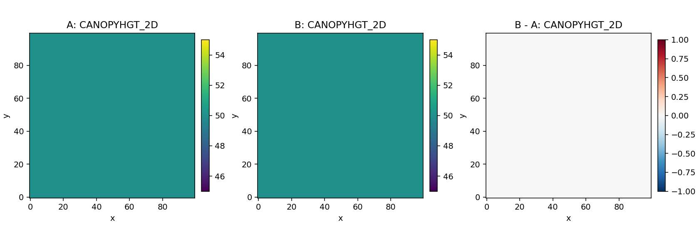
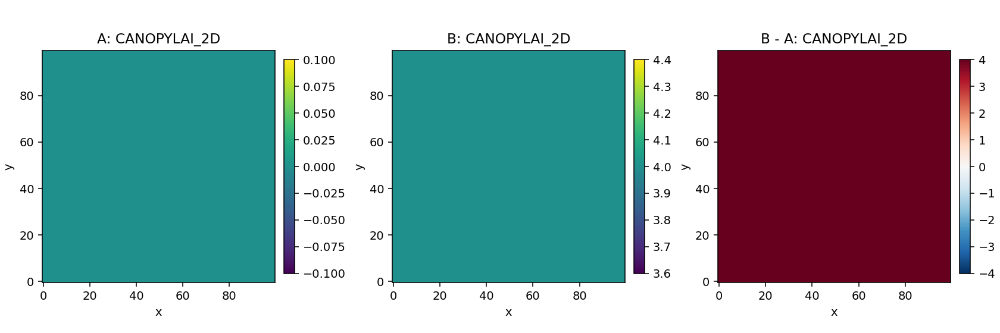
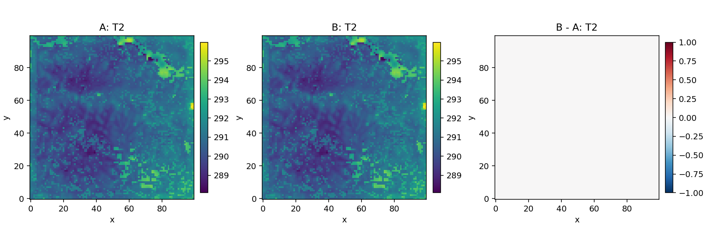
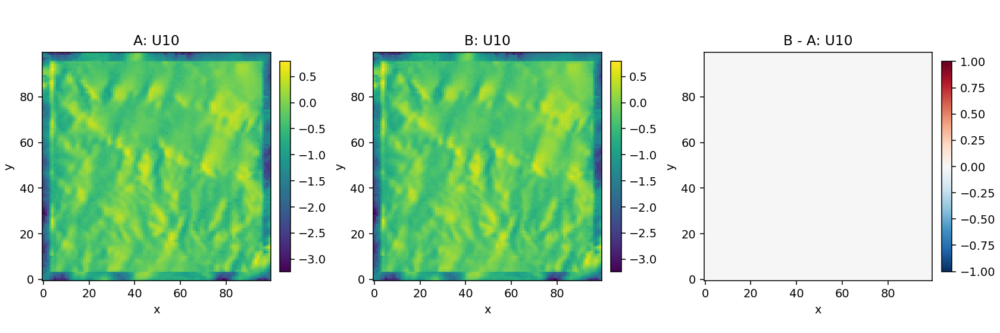
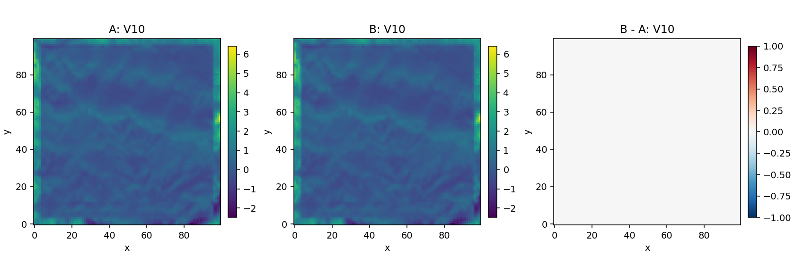
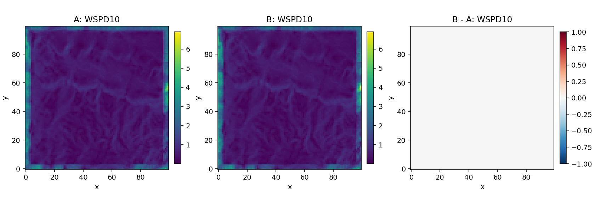
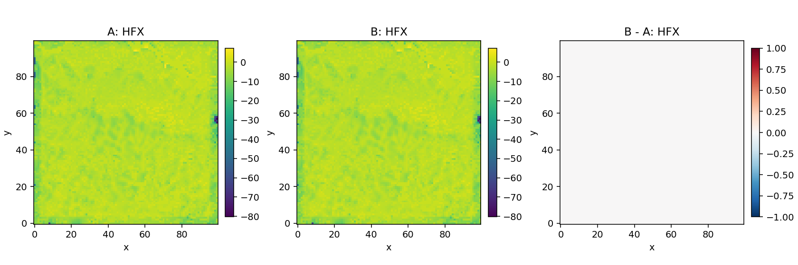
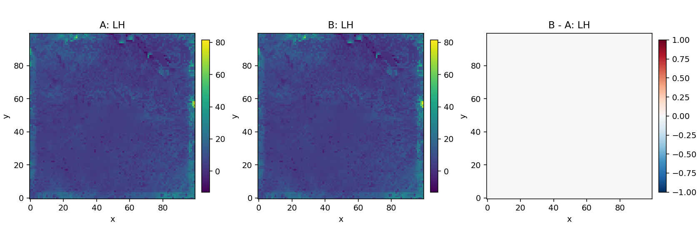

## B vs C (10min): 3D-LAD + height sensitivity

### Quantitative summary

- Structural fields:
  - `CANOPYLAD_3D`: `max_abs_diff=0.305`, `mean_abs_diff=0.129`, `rmse=0.159`
  - `CANOPYHGT_2D`: `max_abs_diff=10`, `mean_abs_diff=10`, `rmse=10`
- Near-surface meteorology and fluxes:
  - `T2`: `max_abs_diff=2.157`, `rmse=0.052`
  - `WSPD10`: `max_abs_diff=0.762`, `mean_abs_diff=0.165`, `rmse=0.184`
  - `HFX`: `max_abs_diff=30.097`, `rmse=0.663`
  - `LH`: `max_abs_diff=12.854`, `rmse=0.500`

### Figures

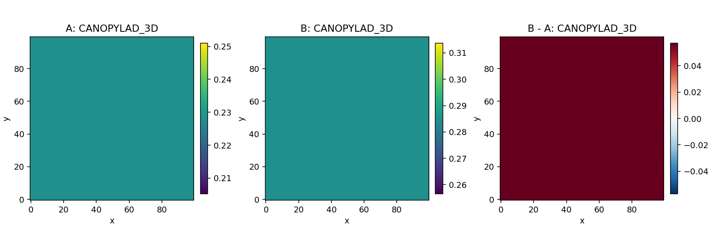
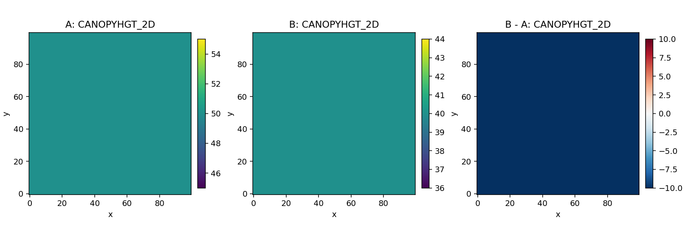

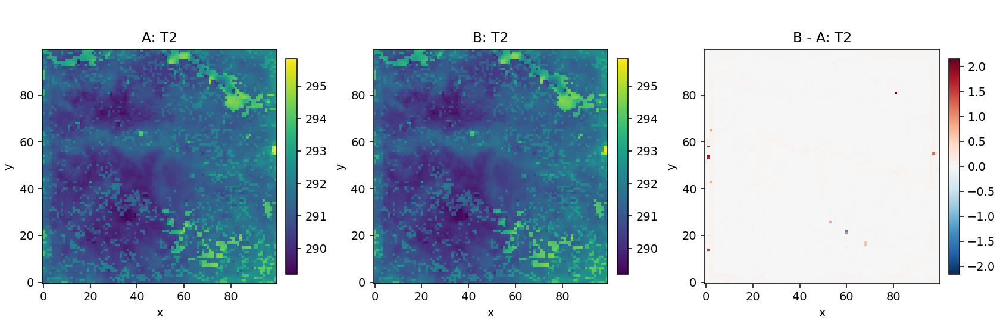
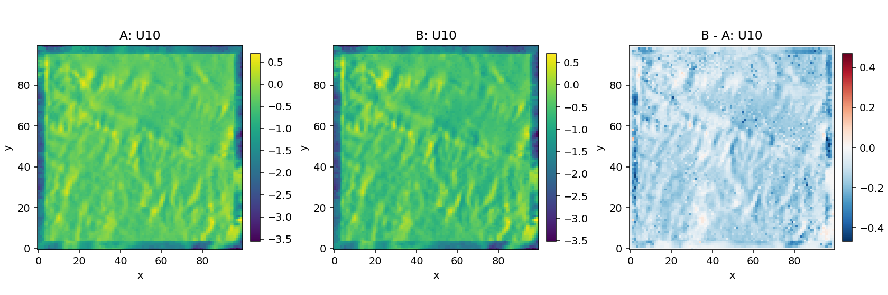
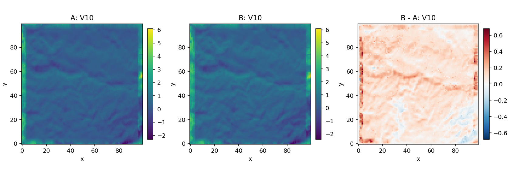
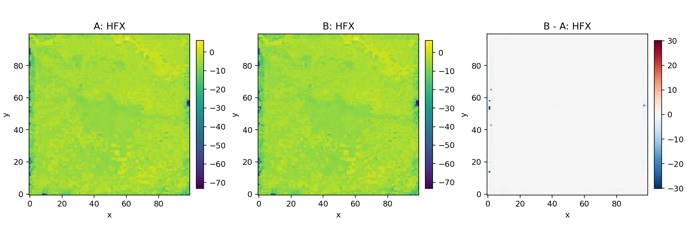
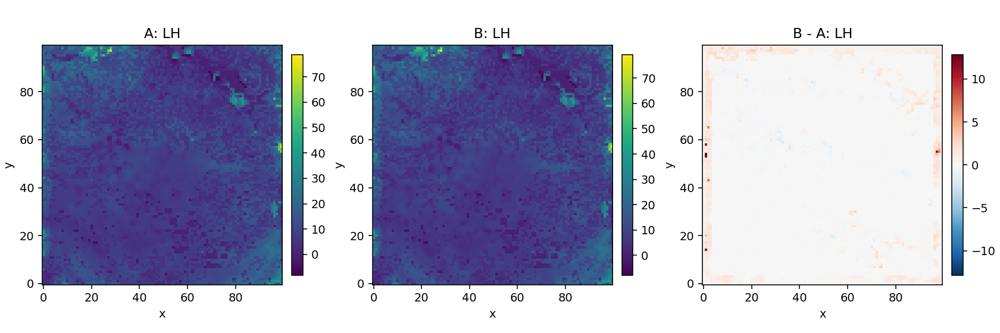
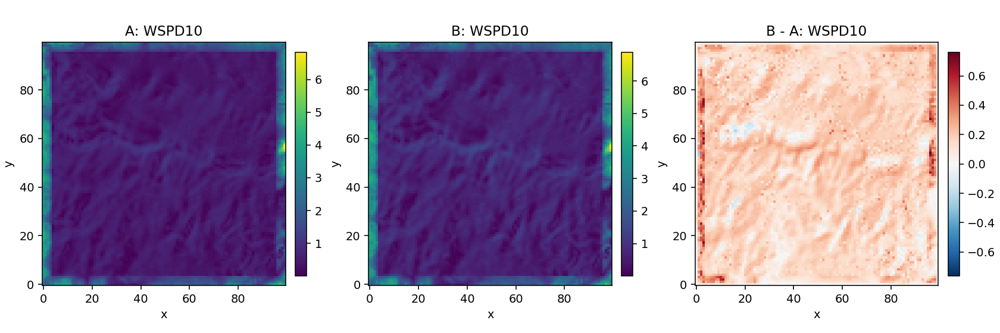

## B vs D (10min): alternative height scenario

### Quantitative summary

- Structural fields:
  - `CANOPYLAD_3D`: no difference (`max_abs_diff=0`, `rmse=0`)
  - `CANOPYHGT_2D`: `max_abs_diff=20`, `mean_abs_diff=15`, `rmse=15.811`
- Near-surface meteorology and fluxes:
  - `T2`: `max_abs_diff=2.124`, `rmse=0.045`
  - `WSPD10`: `max_abs_diff=0.565`, `mean_abs_diff=0.092`, `rmse=0.115`
  - `HFX`: `max_abs_diff=28.049`, `rmse=0.547`
  - `LH`: `max_abs_diff=11.459`, `rmse=0.348`

### Figures

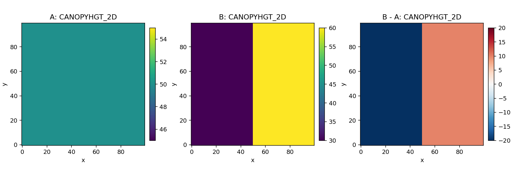
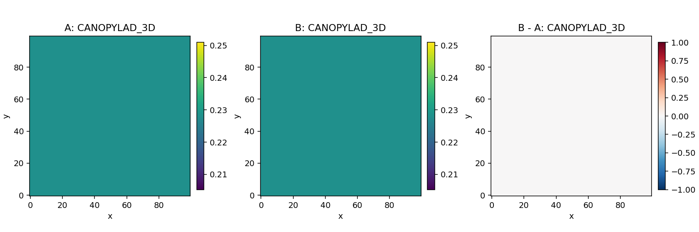
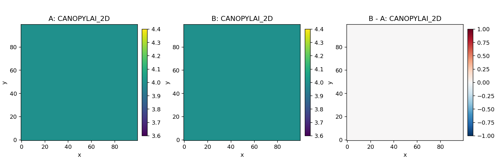
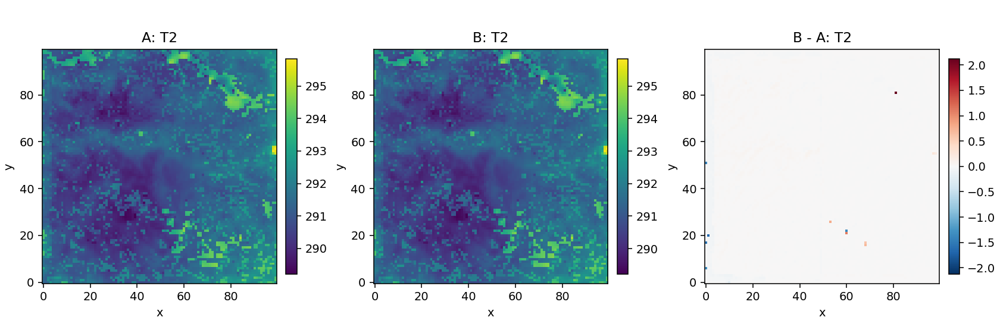
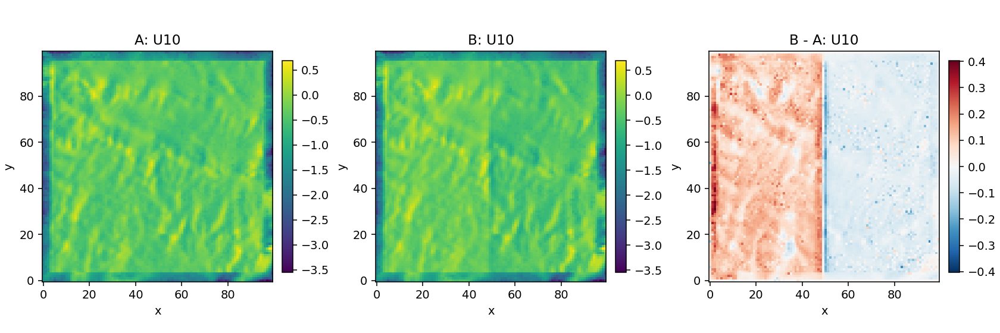
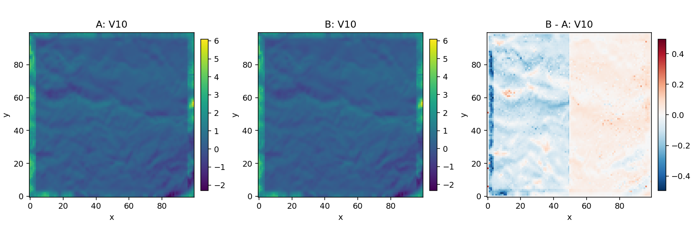

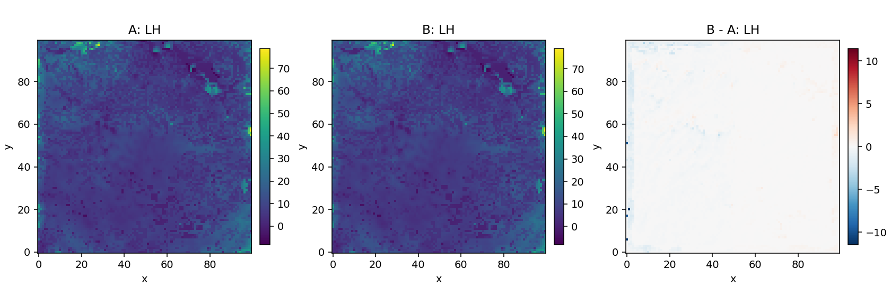
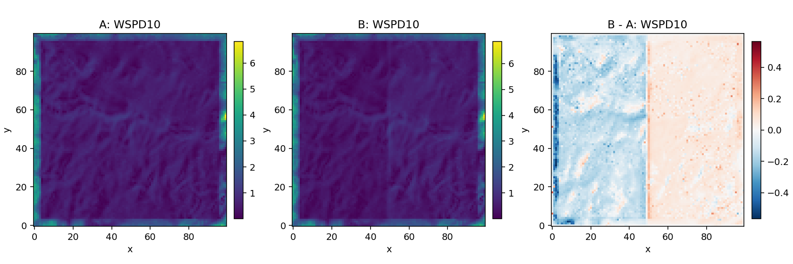

## B vs D vertical wind diagnostics

### Profile point selection

- See `data/windspeed_profile_points_B_vs_D_10min.txt`:
  - `caseB_3dlad: j=0, i=0, selection=max CANOPYHGT_2D=50.00 m`
  - `caseD_althgt: j=0, i=50, selection=max CANOPYHGT_2D=60.00 m`

### Figures

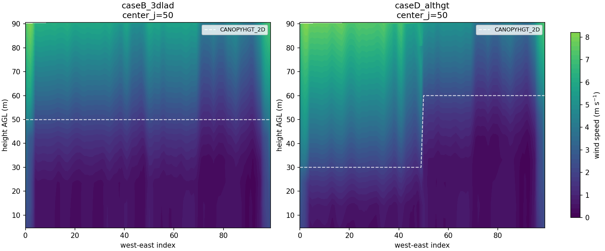
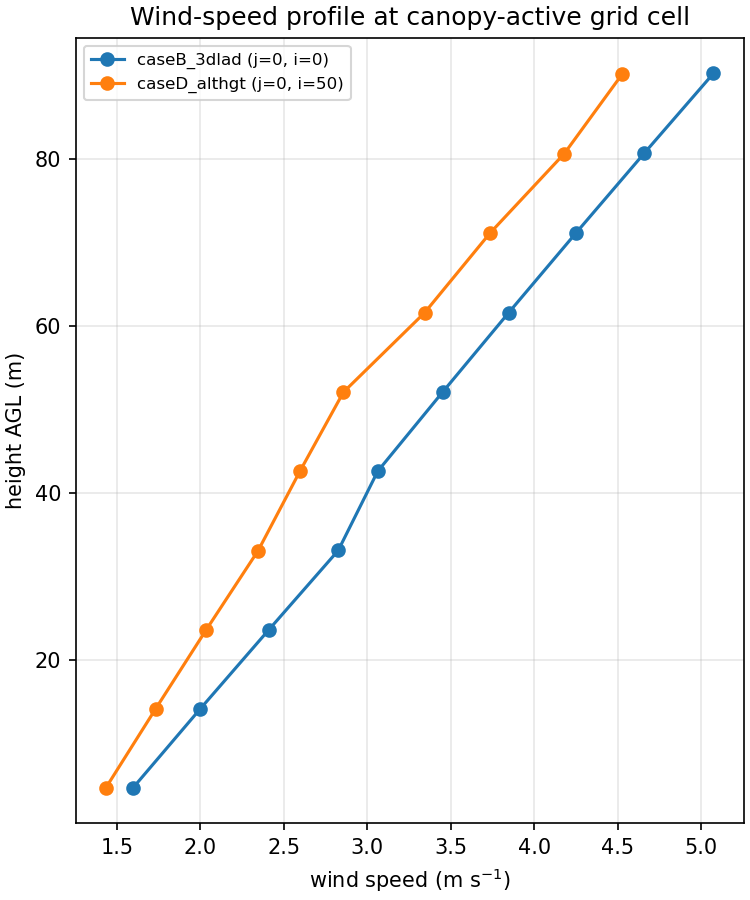
